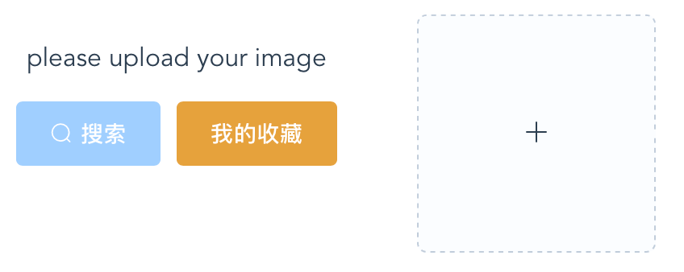
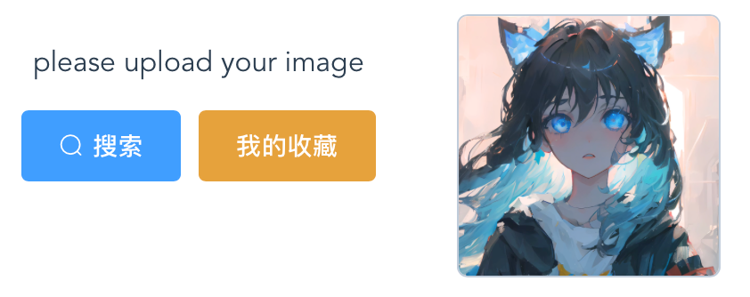
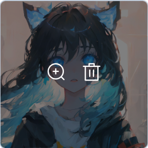
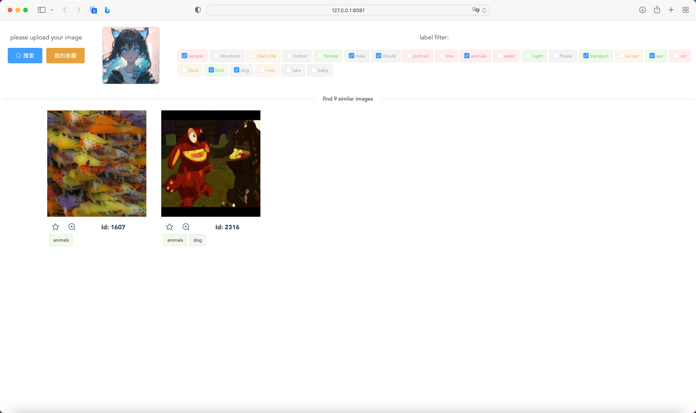
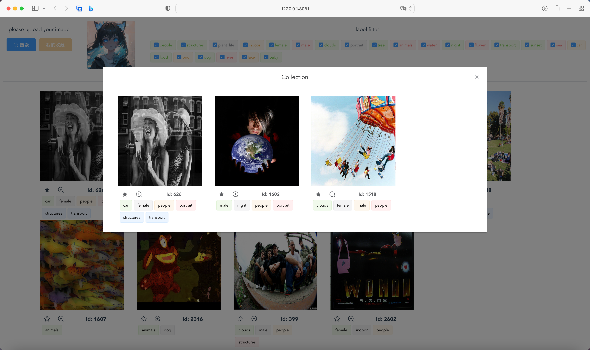

# Human-Computer Interaction

## lab2-image-retrieval

| name      | Student Id |
| --------- | ---------- |
| Liu Chang | 2054164    |


[toc]

### Introduction

#### System Requirements

1. You can preview the image after uploading it, or you can delete it and upload it again.
2. A search button is needed to select similar images from the database and display them.
3. Search results can be filtered based on image tags.
4. You can zoom in to view the image.
5. You can collect pictures and view all the collected pictures in my collection.

#### Dependencies Installation

1. Restore the conda environment using **environment.yaml**

   ```sh
   conda env create -f environment.yaml
   ```

2. Run **image_vectorizer.py** to extract the image features and save them as **neighbor_list_recom.pickle** and saved_features_recom.txt

   ```sh
   python image_vectorizer.py
   ```

3. Go to the **front-end-vue** folder, build the front-end files, and create a **dist** folder

   ```sh
   yarn install
   yarn build
   ```

   In **rest-server.py**, you set the static file directory to read the dist

   ```python
   app = Flask(__name__,
   	static_folder='./front-end-vue/dist',
   	template_folder="./front-end-vue/dist",
   	static_url_path="")
   ```

4. Open a browser and enter [http://127.0.0.1:8081](http://127.0.0.1:8081) to access the **rest-server.py** entry file

   ```sh
   (hci) $ python rest-server.py
    * Serving Flask app 'rest-server'
    * Debug mode: on
   WARNING: This is a development server. Do not use it in a production deployment. Use a production WSGI server instead.
    * Running on all addresses (0.0.0.0)
    * Running on http://127.0.0.1:8081
    * Running on http://198.18.0.1:8081
   Press CTRL+C to quit
    * Restarting with stat
    * Debugger is active!
    * Debugger PIN: 381-710-386
   ```

#### Functionalities Demonstration

1. The initial page, you can directly go to "My collection" to view the collection of pictures, at this time there are no pictures uploaded so can not search



2. After uploading the image, you can click the search button



3. You can delete and upload again, or enlarge the image to view



4. After clicking search, the backend will extract the image features and compare them to get a number of similar images and display them in the frontend


5. Images can be filtered using tags, and each image has a set of tags



6. Each image can be previewed by clicking on the magnifying glass button

  

  7. You can also click the "Favorites" button to favorites a picture and view it in "My Favorites"

  

### Design Details

#### Frontend and Backend Connection

- The frontend uses vue framework and generates dist with npm packaging

- The backend uses flask's built-in render_template function to render the entry index.html from dist to a port

- Visit this port in your browser to see the rendered frontend

#### Frontend Design

- Built using **Vue3** framework and **Element-UI** components

1. Button groups, image uploaders, and tag filters

   Use `el-row` and `el-col` nested inside each other to split the horizontal axis into a ratio of 3:3:18 for button groups, image uploaders, and tag filters. The image uploader uses a custom image-uploader component. The tag filter gets all the tags from the backend, styles the different tags using random numbers, and nested `el-checkbox` to indicate if the image has been selected.

   ```vue
   <el-row>
     <el-col :span="3">
       <el-row>
         <p>please upload your image</p>
       </el-row>
       <el-row type="flex" justify="center" align="middle">
         <el-button
           :icon="isSearchLoading ? 'el-icon-loading' : 'el-icon-search'" type="primary"
           :disabled="fileList.length == 0 || isSearchLoading" @click="search">搜索
         </el-button>
         <el-button
           @click="openCollection" type="warning" @changeCollect="getCollection"
           :disabled="collectDialogVisible">我的收藏
         </el-button>
       </el-row>
   
     </el-col>
     <el-col :span="3">
       <image-uploader class="image-upload" v-bind:fileList="fileList" ref="uploadImage" @success="uploadSuccess" />
     </el-col>
   
     <el-col :span="18">
       <template v-if="responseImage.length != 0">
         <p>label filter:</p>
         <div class="label-list">
           <div v-for="(item, idx) in tags" :key="idx">
             <el-tag :hit="false" :type="item.color">
               <el-checkbox v-model="item.status" @change="tagToggle" />
               {{ item.label }}
             </el-tag>
           </div>
         </div>
       </template>
     </el-col>
   </el-row>
   ```

2. Custom image uploaders

   Here, we add `` and two `<span>` buttons, one for sass style, and one for display, preview and delete, on top of `el-upload` provided by Element-UI. That is, two category selectors with the class names `el-upload-list__item-preview` and `el-upload-list__item-delete`.

   ```vue
   <div class="container">
     <el-upload :class="fileList.length == 1 ? 'more' : 'one'" :limit="1" :multiple="false" action="imgUpload"
       :auto-upload="false" :file-list="fileList" list-type="picture-card" :on-change="handleChange"
       :on-success="handleSuccess" ref="uploadRef"
     >
       <em slot="default" class="el-icon-plus"></em>
       <div slot="file" slot-scope="{file}">
         
         <span class="el-upload-list__item-actions">
           <span class="el-upload-list__item-preview" @click="showImgDiag(file)">
             <em class="el-icon-zoom-in"></em>
           </span>
           <span class="el-upload-list__item-delete" @click="delImg(file)">
             <em class="el-icon-delete"></em>
           </span>
         </span>
       </div>
     </el-upload>
     <el-dialog :visible.sync="isDiagVisible">
       
     </el-dialog>
   </div>
   ```

3. Search results

   If the `responseImage` array is not empty, render an element containing a divider and the length of the `responseImage` array, then loop through each element in the `responseImage` array and pass them to the `ImageCard` component. The `ImageCard` component accepts several attributes, including `imageUrl`, `disallowedTags`, `hideTags`, and `imageId`.

   ```vue
   <div v-if="responseImage.length != 0">
     <el-divider>find {{ this.responseImage.length }} similar images</el-divider>
     <div style="width: 90%;margin:0 auto" class="flex-container">
       <div v-for="(item, idx) in responseImage" :key="idx">
         <ImageCard :imageUrl="item" :disallowedTags="disallowedTags" :hideTags="true" :imageId="item" />
       </div>
     </div>
   </div>
   ```

4. Bookmark Page

   When the user clicks the collect button, it triggers the visibility of this component. Inside the dialog, it uses Vue.js' `v-for` directive to loop through the elements in the `collectImage` array and pass them to the `ImageCard` component for display. It also uses the `v-loading` directive to show a loading animation until the `isFavouriteLoading` variable becomes false. Finally, it uses the pagination component of Element UI, which allows the user to switch between different pages.

   ```vue
   <el-dialog title="Collection" :visible.sync="collectDialogVisible" :close-on-click-modal="false"
     :modal-append-to-body="false" width="65%">
     <div v-loading="isFavouriteLoading">
       <div style="margin:0 auto" class="flex-container">
         <div v-for="(item, index) in collectImage.slice((currentPage - 1) * 3, currentPage * 3)" :key="index">
           <ImageCard :imageUrl="item" :disallowedTags="disallowedTags" :hideTags="false" :imageId="item" />
         </div>
       </div>
     </div>
     <el-pagination background layout="prev, pager, next" :hide-on-single-page="true" :page-size="3"
       @current-change="handleCurrentChange" :total="collectImage.length">
     </el-pagination>
   </el-dialog>
   ```

#### Backend Design

- The back end uses python's flask framework, and the render_template function is used to render the front end interface. The following is a list of interfaces for the front-end and back-end interactions.

1. Get the label associated with each image

   The function first creates an empty dictionary named `imageTags`, then loops through a list of tags `tags`, creates an empty list for each tag, and reads the corresponding file to add the tags to the list. Finally, the function returns a dictionary `imageTags` containing all the image tags. At the end of the code, the function is called and the result is stored in the variable `imageTags`.

   ```python
   def getTagsOfImages():
       imageTags = {}
       for i in tags:
           imageTags[i] = []
           with open(os.path.join(app.config['DATABASE_TAGS'], f"{i}.txt"), 'r') as fp:
               for j in fp.readlines():
                   imageTags[i].append(j.strip())
       return imageTags
   
   imageTags = getTagsOfImages()
   ```

2. Get all labels

   The function first loops through the dictionary `imageTags` and creates a dictionary for each tag that contains two keys, `label` and `size`. The `label` key has the value of the tag name, and the `size` key has the value of the number of images associated with the tag. Then, the `sort` function is used to sort the results in descending order based on the `size` key.

   ```python
   @app.route("/tags", methods=['GET'])
   def getTags():
   		res = [{'label': i, 'size': len(imageTags[i])} for i in imageTags.keys()]
       res.sort(key=lambda x: x['size'], reverse=True)
       return jsonify(res)

3. Getting images

   The function first uses the Flask `request` object to retrieve the `id` from the request parameters. Then, it uses the `open` function to read the image data stored in a file and stores it as a byte stream `byte_data`. Finally, the function uses the Flask `Response` object to return the byte stream to the client, setting the `mimetype` to `image/jpeg`, indicating that the returned image is in JPEG format.

   ```python
   @app.route('/image', methods=['GET'])
   def getImage():
       imageId = request.values.get('id')
       with open(os.path.join(app.config['DATABASE_IMGS'], f"im{imageId}.jpg"), mode='rb') as f:
           byte_data = f.read()
   
       return Response(byte_data, mimetype='image/jpeg')
   ```

4. Getting image information

   The function first uses the Flask `request` object to retrieve the `id` from the request parameters. Then, it opens the favorites file `favorites.txt` and loops through each line to determine whether the image is collected. If it is collected, `isCollected` is set to True; otherwise, it is set to False. Then, the function uses a dictionary comprehension and the `imageTags` dictionary to obtain the list of tags associated with the image.

   ```python
   @app.route('/info', methods=['GET'])
   def getImageInfo():
       imageId = request.values.get('id')
       with open('./database/favorites.txt', mode='r') as f:
           isCollected = False
           for i in f.readlines():
               if i.strip() == imageId:
                   isCollected = True
                   break
       tags = [i for i in imageTags.keys() if imageId in imageTags[i]]
       return jsonify({
           'isCollected': isCollected,
           'tags': tags,
       })
   ```

5. Uploading images

   The function first clears the files in the `RESULT_FOLDER` directory and uses it to store the new files in the subsequent operations. The function supports GET and POST requests. If the request method is not POST or GET, the function will simply return. If the request does not contain a file named `file`, the function will redirect to the current page. If the filename is empty, the function will also redirect to the current page. If everything is fine, the function will retrieve the file from the request and save it to the `UPLOAD_FOLDER` directory. Then, the function calls the `recommend` function and passes the image path and `extracted_features` as parameters to get a list of similar images.

   ```python
   @app.route('/imgUpload', methods=['GET', 'POST'])
   def upload_img():
       shutil.rmtree(app.config['RESULT_FOLDER'])
       os.makedirs(app.config['RESULT_FOLDER'])
       if request.method in ['POST', 'GET']:
           if 'file' not in request.files:
               return redirect(request.url)
           file = request.files['file']
           if file.filename == '':
               return redirect(request.url)
           if file:
               filename = secure_filename(file.filename)
               file.save(os.path.join(app.config['UPLOAD_FOLDER'], filename))
               inputloc = os.path.join(app.config['UPLOAD_FOLDER'], filename)
               image_list = recommend(inputloc, extracted_features)
               return jsonify(image_list)
   ```

6. Get favorite images

   The function first creates an empty list `res`, then opens the favorites file `favorites.txt` and loops through each line to add the image ID to `res`.

   ```python
   @app.route('/collect/all', methods=['GET'])
   def getCollects():
       res = []
       with open('./database/favorites.txt', mode='r') as f:
           for i in f.readlines():
               res.append(i.strip())
       return jsonify(res)
   ```

7. Bookmark/Unbookmark

   The function first uses the Flask `request` object to retrieve the image ID from the request parameters and reads the content of the favorites file `favorites.txt`. Then, the function defines an empty list `p` and a boolean variable `isCollected`, and loops through each element in `s`. If the current element is the same as the image ID, `isCollected` is set to True; otherwise, the current element is added to `p`. If the image is not collected, the image ID is added to the end of `p`. Then, the function uses the `open` function to reopen the favorites file and loops through each element in `p`, writing them to the file.

   ```python
   @app.route('/collect', methods=['GET'])
   def modifyCollectState():
       imageId = request.values.get('id')
   
       with open('./database/favorites.txt', mode='r') as f:
           s = f.readlines()
   
       p = []
       isCollected = False
       for i in s:
           if i.strip() == imageId:
               isCollected = True
           else:
               p.append(i.strip())
   
       if not isCollected:
           p.append(imageId)
   
       with open('./database/favorites.txt', mode='w') as f:
           for index, item in enumerate(p):
               if index != len(p) - 1:
                   f.write(item + '\n')
               else:
                   f.write(item)
   
       return jsonify({'status': True})
   ```
